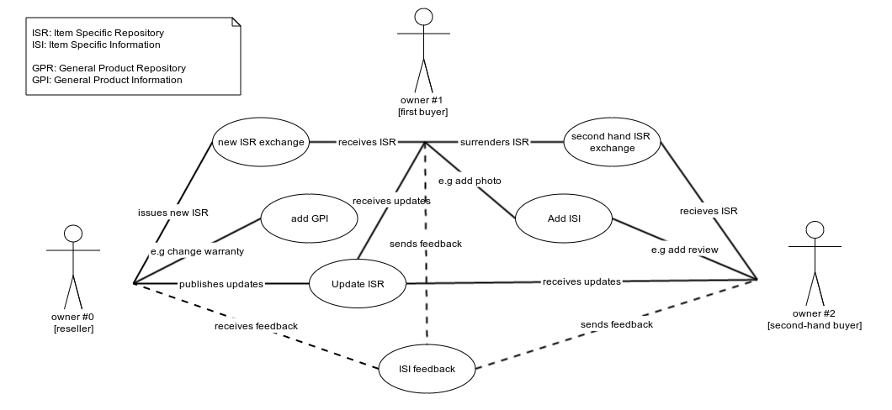

##Use Case

It use case diagram

###Issue new ISR

###Transfer ISR

##Platform
Most online purchases today are made in a web browser and the most common web browser is Google Chrome. A Google Chrome application gets access to the user's file system and can be used also when the user is offline. It is also said to be fairly simple to port a Google Chrome Application to an Open Web Application for use in the Firefox browser. A Google Chrome and Firefox implementation would result in a possible reach of about 60% of the desktop browser market share as of January 2014. 

##Storage
Support a possible use case where the ISR is stored on the actual product. The ISR could be stored in multiple locations, e.g. on the user's computer, smartphone and within the product. 

Store item specific information in an .it folder? Then the git and it features could be kept separate. The first prototype could be just a bash script with some CLI commands? 

###Remotes
> A remote repository is generally a bare repository — a Git repository that has no working directory. 

Use a node.js server as an example for the prototype. On this server only the 'builds' i.e the public HTML profiles should be shown.

##Unique Product Identification (UPI)
The UPI could be a hash of the user's public ssh key and the time of initiation of the thing. This assumes that no one user 'creates' multiple things at the same time. With a mint the information about who created the thing and at what time can be obtained by just knowing the UPI. 

##RFID on Product
The product can store the 160 bit (20 byte) hash of a git commit on an (unencrypted?) RFID tag? 
###Type of RFID chip

###Transaction History / Proof of purchase
Should there be a way to prove that a certain user cloned a certain remote GPI repository into a ISR at a certain time? Look into the bitcoin architecture for implementations of cryptographic proofs.

Bitcoin keeps a distributed P2P ledger of the global transaction history. The transaction history is represented as a chain of digital signatures. A similiar chain of digital signatures could be kept for just a certain product. This item specific transaction chain can in It's case be stored on a RFID tag attached to the product itself as well as in the ISR. While bitcoin output transactions declare a value to be transfered the It implementation instead stores the hash of the current Git commit, i.e the HEAD of the repository.

[Bitcoin transactions explained]
(https://en.bitcoin.it/wiki/Transaction)
##Authentication
the owner needs to store its private SHA-128 key somewhere. 

###Protocol
> Git can use four major network protocols to transfer data: Local, Secure Shell (SSH), Git, and HTTP. 

> SSH is also the only network-based protocol that you can easily read from and write to. The other two network protocols (HTTP and Git) are generally read-only, so even if you have them available for the unwashed masses, you still need SSH for your own write commands. SSH is also an authenticated network protocol; and because it’s ubiquitous, it’s generally easy to set up and use.

Focus on SSH in the prototype? 

> The negative aspect of SSH is that you can’t serve anonymous access of your repository over it. People must have access to your machine over SSH to access it, even in a read-only capacity, which doesn’t make SSH access conducive to open source projects. 

This isn't really an issue for ISR since we won't need anonymous pulling support from our directory. 

##Display
How should the ISR be served to your curious friends? 

###HTML
The it script could generate a public HTML profile of the thing after each new commit? Static HTML loads fast and could be publicly visible without the need for pulls from the directory. This would be the 'build' of the ISR. 

###JSON
Json data could be generated as well to accomodate many possible different third party clients. How should they authenticate themselves?

###Workflow

>Git is fundamentally
a content-addressable filesystem.
>
>at the core of Git is a simple key-value data store.
>
>[plumbing commands] aren’t meant to be used manually on
the command line, but rather to be used as building blocks for new tools and custom scripts.

>Pro Git