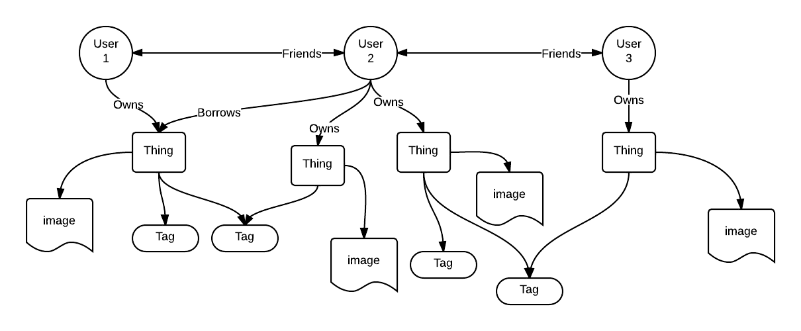

(G)It
==

Distributed product history powered by Git.

## Background
In "The Architecture of Open Source Software Applications - Volume 2" Susan Potter states that
"Git enables the maintenance of a digital body of work (often, but not limited to, code) by many collaborators using a peer-to-peer network of repositories. It supports distributed workflows, allowing a body of work to either eventually converge or temporarily diverge."

## Introduction
Git is, according to Susan Potter, in its structure not limited to exclusively manage source code history. A manufactured physical product does, in a way not very different to source code, collect a kind of history after it has left the store. Just like source code, products can be considered to be "cloned" by customers when they are bought. Information about the product then diverges over time if it is damaged or reviewed by the customer who bought it. Later on the customer's version of the product history can converge with the manufacturer's version and create a merged version containing more information about the product. Could Git be used to manage this kind of product history? In which ways can Git be changed to better manage product history? How could this kind of distributed product history change how we own products?

## Product ownership as an directed acyclic graph
Version history is in Git represented as a directed acyclic graph (DAG). Below is my first attempt at representing product ownership as a DAG. 

## Design Goals

- **Functionality:** It should be easier to add a new thing to the system than it is to create a second-hand ad on for example Ebay.

- **Functionality:** An added thing should be given a persistent digital profile (preferably in the shape of one single file).

- **Functionality:** A user should be able to lend, borrow and sell things to trusted friends.

- **Environment:** The system should be designed to promote local exchanges between friends in order to avoid unnecessary transports.

- **Integrity:** Users should themselves have control over the data they generate.

## Example Graph

## Nodes and Relationships
The system consists of persons, things, tags and images that are connected in a directed graph.

### User
- When a user is created it is assigned a public-private key pair. The public key is added as an attribute to the user node where as the private key is stored in a special file on that user's device.

### Thing
- Is owned by one or more users.
- Can be connected to one or more images.
- Can be connected to one or more tags.
- Has an optional price attribute.
- *The price can be used to control the visibility of the thing. Perhaps you only want your friends to see things worth less than 500$ and friends of friends to only see things worth less than 100$.*
- *Can be created when a user purchases something on-line or by taking a photo of an already owned possession.*
- *A thing and its children can be serialized and stored in a file.*

### Image
- Portrays one thing.
- *Can possibly be used to identify the thing it portrays. Efficient object recognition might be possible if the search is limited to only one user's possessions.* 

### Tag
- Has a name attribute stored as a string.
- *Can be connected to a category by the use of for example a dictionary graph.*

### Ownership
- Is a one-way directed relationship between one or more users and one thing.
- Has a starting date attribute.
- **Borrowing:** Add an end date.
- **Renting:** Add a price per day and an end date.

## Problems to Solve
- How should things be easily identified? *Object recognition in images?*
- How can your graph be shared with friends without you loosing control over its content? *Encryption? Impossible?!*
- How can your graph be read while you are off-line? *Make your friends act as a server serving content from your graph to your friends? Read up on P2P architectures!*

