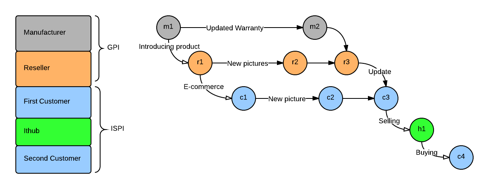

====

Distributed product information and life cycle management powered by Git.

## Background
>Git enables the maintenance of a digital body of work (often, but not limited to, code) by many collaborators using a peer-to-peer network of repositories. It supports distributed workflows, allowing a body of work to either eventually converge or temporarily diverge.
>
>[*AOSA*][aosa]

## Introduction
Git is, according to Susan Potter, in its structure not limited to exclusively manage source code history. A manufactured physical product could possibly, in a way not very different to source code, change after it has left the store. Just like source code, products can be considered to be "cloned" by customers when they are bought. Information about the product then diverges over time if it is damaged or reviewed by the customer who bought it. Later on the customer's version of the product history can converge with the manufacturer's updated version and create a merged version containing more information about the product. Could Git be used to manage this kind of dynamic product information? In which ways can Git be changed to better manage information about physical products? How could this kind of product repositories be used as a persistent ad for our belongings?

##Why Use Version Control for Product Information?
>A version control system (VCS) usually has three core functional requirements, namely:
>
> - Storing content
> - Tracking changes to the content (history including merge metadata)
> - Distributing the content and history with collaborators
>
> [*AOSA*][aosa]

These functionality requirements would in my opinion apply to product information tracking as well. But is it really possible and even necessary to use a VCS for products? Furthermore, is a distributed VCS, like for example Git, really the right tool for keeping track of product information?

###Dumb Products
Expensive products with a long expected lifetime, like for example cars, have already been used to being associated with some kind of version history. That is because if you buy a second hand car you would probably want to know the history of the car you are buying. If a system that is simple enough to use would be created this kind of history tracking could be applied to cheaper products as well. You can think of an It repository as a kind of dynamic ad. 

###Smart Products
As the Internet of Things (IoT) is emerging we start seeing products that themselves create data about their usage history. This makes it more feasible that a version history for each product will be maintained since the product itself will generate the data rather than its assumable lazy owner. This data also has its own value and a decent way of storing is therefore of considerable importance. 

###The Environment
Giving each product a digital repository would provide an incentive to not just throw away the product as it gets older. Companies would then be more inclined to produce longer lasting products if the life of these would be increasingly exposed in more or less public It repositories. It would also be easier for customer to resell the product if they could provide the new owner with a It repository. 

##Why Distributed?

> However, it seems evident that the extreme centralised information management 
solution ... is only realistic as long as the number of participating 
organisations is small.
>
>[*Corcelle, Främling and Rabe Et. Al*][framling]

If we would invite a product's consumers to participate in the information management of the product it would according to the above quote not be realistic with a centralized solution. So what are the benefits if we were to instead use a distributed approach?

>Specific benefits of a distributed model include:
>
> - Providing the ability for collaborators to work offline and commit incrementally.
Allowing a collaborator to determine when his/her work is ready to share.
> - Offering the collaborator access to the repository history when offline.
> - Allowing the managed work to be published to multiple repositories, potentially with different branches or granularity of changes visible.
>
>[*AOSA*][aosa]

Personal possessions are closely linked to their owners and integrity is hence key when dealing with their usage history. By using a distributed system like Git to track this history we can use the features mentioned above in order to allow the owners of products to keep their own private history and only share it, in a chosen level of detail, to different external repositories. These external repositories may belong to for example a second-hand buyer of their possession or a manufacturer interested in customer feedback. 

##Why Git?

**+** 
Cloning product information repositories from manufacturers and second-hand resellers would be a good way for customer to initially retrieve and store information about a bought product.

**+** 
Git is fast because most operations run locally and that it is written in C.
 
**+**
Git's distributed architecture empowers customers to only share product information that they generate at their own will.

**+**
Proficiency of Git among developers makes for a potentially better third-party adoption.

**-**
Unnecessarily complex UI?

**-**
Git is based on a developer's work-flow. Could this be mapped or simplified somehow to resemble that of a git-illiterate customer using a GUI? (for example the staging area feature)

##Repository Structure
Rather than source code a Git repository for a physical product, hereafter called an "It repository", could contain the following content:

- Photos of the product taken by its manufacturer, resellers and customers.
- Damages to the product reported by customers.
- Warranty information provided, and updated, by the manufacturer and/or store.
- A page where all of the data is presented could be stored as JSON data. This file may be auto-generated in a pre-commit hook.

Example of an it repository's file tree structure.

	root  
	|--Photos  
	|--Damages  
	|--Reviews
	|--Warranties   
	+--Profile.json

The metadata stored in each commit in Git could also contain some extra information if the source code of Git were to be manipulated:

- An initial commit, i.e a clone in the case of a new customer, would always contain the price paid for the product as metadata.

But since Git is designed to represent any file tree structure it is completely free for the manufacturer of a product to set up their own structure. 

##Branching model

>It’s generally easier to think about them [branches] as work silos, where sets of commits graduate to a more stable silo when they’re fully tested (see Figure 3-19).
>
>[*Pro Git*][progit]

A "more stable silo" could in the case of branches of It repositories correspond to  a closer association with the core product. The so called master, develop and topic branches could instead correspond to the manufacturer, reseller, buyer and second hand buyer of a product in an It branching model. 

How Git's branching model could be used to share product information among first and second hand owners as well as the manufacturer and reseller.

###Comments

- Below the reseller layer everything added by contributors should be considered to be item specific product information (ISPI). How should we distinguish between ISPI and general product information (GPI) repositories?

- There is no pushing upstreams from ISPI repositories. ISPI repositories are in their nature rather different from the GPI repositories which are more easily mapped to common git workflows.

- ISPI repositories could be associated with an ID@URI or EPC identifier.

- At EOL the ISPI repository could be uploaded by the last customer to the manufacturer. The product life cycle data gathered in the ISPI repository should be of considerable value to the manufacturer. 

The branching model of an It repository would follow a set of rules - essentially making it a subset of all the work-flows that Git supports. 

>Your local branches aren’t automatically synchronized to the remotes you write to — you have to explicitly push the branches you want to share. That way, you can use private branches for work you don’t want to share, and push up only the topic branches you want to collaborate on.
>
>[*Pro Git*][progit]

A customer could use different branches for different levels of privacy. The names of these branches could be for example the private, friends and public branch.

##Merging Strategy
A suitable merging strategy for product information needs to be developed or chosen among existing ones.  

[framling]: http://www.cs.hut.fi/~framling/Publications/PLM_07_CorcelleFramlingRabeEtAl.pdf
	"Assessment of item-specific information management approaches in the area of heavy load vehicles. "
[aosa]: http://aosabook.org/en/git.html
    "the Architecture of Open Source Software Applications - vol 2"
[progit]: http://git-scm.com/book/en/
    "Pro Git"

